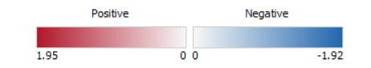

<style>
body {
  font-size: 18px;
}

caption {
  font-size: 16px;
  font-style: italic;
}
</style>

```{r setup, include=FALSE, echo=FALSE}
knitr::opts_chunk$set(
                      warning = FALSE, # suppressing warning messages
                      message = FALSE,
                      knitr.kable.max_rows = 5)

# attach packages
if(!require(dplyr)){
  install.packages(c("dplyr"))
}
if(!require(tidyr)){
  install.packages(c("tidyr"))
}

library("rmarkdown")
library("dplyr")
library("tidyr")
library("kableExtra")
library("edgeR")
library("limma")
library("RColorBrewer")
library("ggplot2")
library("gprofiler2")
library("fgsea")
library("RCurl")

# load results from previous assignment
top_tags <- readRDS("~/projects/bcb420-assignment2/degs.RDS")
```

# Introduction {#introduction}
 
Dengue virus (DENV) remains a threat to health, especially within tropical climates [@Poonpanichakul2021; @Bhatt2013]. Clinical manifestations of DENV vary in severity, for example patients may be asymptomatic, experience mild dengue fever (DF), or have severe dengue haemorrhagic fever (DHF) [@Bhatt2013; @Kok2023]. Because the latter may lead to the even more severe dengue shock syndrome (DSS), it is important that DENV infections be studied further. In particular, there is potential for important findings in the role of the innate immune system and especially the newly-discovered helper innate lymphoid cells (hILCs) to be made that may help us understand the factors behind the heterogeneity in DENV infection symptoms, especially relating to infection severity [@Guia2020; @King2020].

Previously, a differential gene expression analysis was conducted using an hILC RNA-seq dataset by @Poonpanichakul2021, investigating differential expression in hILCs between patients in the febrile phase (initial first week) of mild dengue fever (DF) and dengue haemorrhagic fever (DHF) [@Kok2023]. The dataset was downloaded from GEO, using the accession id `GSE155672`. The original dataset (count matrix) was subsetted for samples in the febrile phase, yielding 3 samples for 2 conditions which were DHF and DF. Unversioned Ensembl IDs from the count matrix were mapped onto HUGO gene symbols. Then, lowly-expressed genes were filtered, followed by TMM normalisation and differential expression analysis through `edgeR` [@edger]. After filtering lowly-expressed genes, all rows of the count matrix were mapped onto HUGO gene symbols. Differential expression analysis was done using the quasi-likelihood pipeline from `edgeR` [@edger] From the analysis, 3 differentially expressed genes which had an adjusted p-value of less than 0.05 were found, which were SEC13, IGHG1, and PTEN.

In this investigation, based on the results of the analysis, we will use a thresholded and non-thresholded gene set analysis to investigate gene sets that are enriched in our gene list.

# Thresholded Over-representation Analysis {#thresholded-analysis}

The easiest first step we could do is a thresholded over-representation analysis. By limiting the analysis to a number of genes from the initial gene set based on some threshold, we can reduce computational power needed, and we can get results that are easy to interpret.

## ORA {#ora}

For the over-representation analysis (ORA), I decided to use `g:profiler` [@gprofiler]. I chose this method because it is a well-known method that I think will be easy to use, uses updated gene sets and annotations, and can be run through code in an R notebook, namely using the `gprofiler2` package [@gprofiler2].

### Whole list {#whole-list-ora}

First, let us try running the analysis with the whole gene list. The gene list from previous analyses has been loaded in setting up this document, but has not been filtered/thresholded. As only 3 genes were returned when filtering for FDR < 0.05, this time I decided to filter based on nominal p-value < 0.05. After filtering, we end up with a whole list of 556 genes.

```{r ora-threshold}
sprintf("Number of genes before: %s", nrow(top_tags))

# only include genes where p-value is less than 0.05
thresholded_tags <- top_tags %>%
  filter(PValue < 0.05)
sprintf("Number of genes after: %s", nrow(thresholded_tags))
```

Now we can conduct ORA, first with the whole gene list. For this analysis, we choose to show all results, not just the ones that are significant based on the default threshold of p-value < 0.05. We set the sources/gene sets to be from Reactome, WikiPathways and GO:Biological Process, with excluding IEA (Inferred from Electronic Annotation). This is so that we can investigate which pathways are enriched in our gene set, while preferring terms that have evidence that is more reliable. We will also set limits to the gene set size, to avoid terms that are too broad or too specific to be easily interpretable. Thus, we set the gene set size to be between 10 and 200, inclusive.

```{r ora-whole, fig.cap="Manhattan plot showing the results of each term that was returned from the ORA analysis of the whole gene list of genes differentially expressed in hILCs of dengue haemorrhagic fever (DHF) patients compared to mild dengue fever (DF) patients. Plot is based on source and -log adjusted p-value. Each circle represents a gene set/term, where its size corresponds to the gene set size, and the opacity corresponds to its significance, where significance is determined by a threshold of adjusted p-value < 0.05. ORA was conducted using g:profiler, and plot was generated by the gprofiler2 R package. P-values were corrected by FDR."}

query <- rownames(thresholded_tags)

set.seed(1008812000) # seed for reproducibility
ora_results <- gost(query = query,
                    significant = FALSE,
                    ordered_query = FALSE,
                    exclude_iea = TRUE,
                    user_threshold = 0.05,
                    correction_method = "fdr",
                    organism = "hsapiens",
                    source = c("REAC","WP","GO:BP"))

# filter the results by size, and save
whole_ora <- ora_results$result %>%
  filter(term_size >= 10, term_size <= 200)

# plot Manhattan plot
gostplot(ora_results, interactive = FALSE, 
         capped = FALSE) +
  labs(title = paste0("Manhattan plot of ORA results, ",
                     "with using the whole gene list of\n",
                     "differentially expressed genes in DHF patients ", 
                     "compared to DF patients. (total: ",
                     nrow(ora_results$result), ")"))
```

Let us also preview the results that we got from the analysis, filtered for gene sets between 10 and 200 genes inclusive, and arranged in ascending p-value order.

```{r whole_ora_res, tab.cap="Table showing the results of the ORA based on the whole gene list of genes differentially expressed in hILCs of dengue haemorrhagic fever (DHF) patients compared to mild dengue fever (DF) patients. Results are arranged in ascending order of p-value, and rows with p-value < 0.05 are highlighted in yellow. p_value = the corrected p-value, correction done using FDR. term_size = the size of the term i.e. number of genes in the gene set. intersection_size = the number of genes from the query that is included in each term. source = the source from which the gene set originates. Here, GO:BP refers to GO:Biological Process. term_name = the name of the gene_set, as found in the source. "}

# which values are significant (p < 0.05)
sig <- which(whole_ora$p_value < 0.05)

whole_ora[,-c(1,2,5,7,8,9,12,13,14)] %>%
  kable(row.names = FALSE, format = "html") %>%
  kable_styling() %>%
  scroll_box(height = "1000px", width = "100%") %>%
  row_spec(sig, color = "black", background = "yellow")
```

We can notice that the top results mostly relate to protein modification and transport. However, for a deeper look into which processes may be up-regulated and which ones are down-regulated, we can run ORA separately for up-regulated and down-regulated genes.

### Up-regulated only {#upreg-ora}

To conduct ORA on only up-regulated genes, we need to first apply an extra filter to the top-tags -- that is, we need to filter for positive fold-changes. It seems that 221 genes were upregulated, i.e. had a log fold-change greater than 0.

```{r ora-threshold-upreg}
sprintf("Number of upreg. and downreg. genes after threshold: %s", nrow(thresholded_tags))

# only include genes where p-value is less than 0.05 and +ve logFC
thresholded_upreg_tags <- top_tags %>%
  filter(PValue < 0.05, logFC > 0)
sprintf("Number of upreg. genes after threshold: %s", nrow(thresholded_upreg_tags))
```

Next, we can just repeat the previous ORA, but with using this new gene list of upregulated genes.

```{r ora-upreg, fig.cap="Manhattan plot showing the results of each term that was returned from the ORA analysis of the gene list of genes upregulated in hILCs of dengue haemorrhagic fever (DHF) patients compared to mild dengue fever (DF) patients. Plot is based on source and -log adjusted p-value. Each circle represents a gene set/term, where its size corresponds to the gene set size, and the opacity corresponds to its significance, where significance is determined by a threshold of adjusted p-value < 0.05. ORA was conducted using g:profiler, and plot was generated by the gprofiler2 R package. P-values were corrected by FDR."}

query <- rownames(thresholded_upreg_tags)

set.seed(1008812000) # seed for reproducibility
upreg_ora_results <- gost(query = query,
                    significant = FALSE,
                    ordered_query = FALSE,
                    exclude_iea = TRUE,
                    user_threshold = 0.05,
                    correction_method = "fdr",
                    organism = "hsapiens",
                    source = c("REAC","WP","GO:BP"))

# save results without filtering for size.
upreg_ora <- upreg_ora_results$result %>%
  filter(term_size >= 10, term_size <= 200)

# plot Manhattan plot
gostplot(upreg_ora_results, interactive = FALSE, 
         capped = FALSE) +
  labs(title = paste0("Manhattan plot of ORA results, ",
                     "with using the list of upregulated genes,\n",
                     "in DHF patients compared to DF patients. (total: ",
                     nrow(upreg_ora_results$result), ")"))
```

One may have noticed that all the circles in the Manhattan plot are translucent, which shows that the terms yielded by the analysis were not statistically significant. To confirm this, we can look at the first 5 results, as before.

```{r upreg_ora_res, tab.cap="Table showing the first 5 results of the ORA based on the gene list of genes upregulated in hILCs of dengue haemorrhagic fever (DHF) patients compared to mild dengue fever (DF) patients.  Results are arranged in ascending order of p-value. p_value = the corrected p-value, correction done using FDR. term_size = the size of the term i.e. number of genes in the gene set. intersection_size = the number of genes from the query that is included in each term. source = the source from which the gene set originates. Here, GO:BP refers to GO:Biological Process. term_name = the name of the gene_set, as found in the source. "}

head(upreg_ora, 5)[,-c(1,2,5,7,8,9,12,13,14)] %>%
  kable(row.names = FALSE, format = "html") %>%
  kable_styling() %>%
  scroll_box(height = "100%", width = "100%")
```

Since the top result has an adjusted p-value > 0.05, we can conclude that that is the case for all the other results (after filtering). Although these results were not statistically significant, one thing to note is that 2 of the top 5 terms are explicitly related to MHC II protein complex assembly, which is a process occurring in antigen-presenting cells [@Roche2015]. This includes macrophages which are part of the innate immune system, and dendritic cells which act as messengers between the innate and adaptive immune system [@Chaplin2010; @Roche2015].

### Down-regulated only {#downreg-ora}

While no significantly enriched gene sets were returned from conducting ORA on only upregulated genes, we might see different results by also conducting a similar analysis but for down-regulated genes. We thus repeat the filtering of log fold-change, except this time for negative log fold-change. It seems that 335 genes were downregulated, i.e. had a log fold-change less than 0.

```{r ora-threshold-downreg}
sprintf("Number of upreg. and downreg. genes after threshold: %s", nrow(thresholded_tags))

# only include genes where p-value is less than 0.05 and -ve logFC
thresholded_downreg_tags <- top_tags %>%
  filter(PValue < 0.05, logFC < 0)
sprintf("Number of downreg. genes after threshold: %s", nrow(thresholded_downreg_tags))
```

Again, we repeat the same ORA as in [the whole list ORA](#whole-list-ora), except with using the list of down-regulated genes.

```{r ora-downreg, fig.cap="Manhattan plot showing the results of each term that was returned from the ORA analysis of the gene list of genes downregulated in dengue haemorrhagic fever (DHF) patients compared to mild dengue fever (DF) patients. Plot is based on source and -log adjusted p-value. Each circle represents a gene set/term, where its size corresponds to the gene set size, and the opacity corresponds to its significance, where significance is determined by a threshold of adjusted p-value < 0.05. ORA was conducted using g:profiler, and plot was generated by the gprofiler2 R package. P-values were corrected by FDR."}

query <- rownames(thresholded_downreg_tags)

set.seed(1008812000) # seed for reproducibility
downreg_ora_results <- gost(query = query,
                    significant = FALSE,
                    ordered_query = FALSE,
                    exclude_iea = TRUE,
                    user_threshold = 0.05,
                    correction_method = "fdr",
                    organism = "hsapiens",
                    source = c("REAC","WP","GO:BP"))

# filter the results by size, and save
downreg_ora <- downreg_ora_results$result %>%
  filter(term_size >= 10, term_size <= 200)

# plot Manhattan plot
gostplot(downreg_ora_results, interactive = FALSE, 
         capped = FALSE) +
  labs(title = paste0("Manhattan plot of ORA results, ",
                               "with using the list of downregulated genes\n",
                               "in DHF patients compared to DF patients. (total: ",
                               nrow(downreg_ora_results$result), ")"))
```
Interestingly we get more significant results with this list. Again, we can look at the results from this ORA. 

```{r downreg_ora_res, tab.cap="Table showing the results of the ORA based on the gene list of genes downregulated in hILCs of dengue haemorrhagic fever (DHF) patients compared to mild dengue fever (DF) patients.  Results are arranged in ascending order of p-value, and rows with p-value < 0.05 are highlighted in yellow. Significant results which were not significant in the whole list ORA are bolded. p_value = the corrected p-value, correction done using FDR. term_size = the size of the term i.e. number of genes in the gene set. intersection_size = the number of genes from the query that is included in each term. source = the source from which the gene set originates. Here, GO:BP refers to GO:Biological Process. term_name = the name of the gene_set, as found in the source. "}

# which values are significant (p < 0.05)
sig <- which(downreg_ora$p_value < 0.05)

# which values are not present when using whole list
whole_non_overlap <- which(!(downreg_ora$term_name %in% whole_ora[c(sig),]$term_name) &
                        downreg_ora$p_value < 0.05)

downreg_ora[,-c(1,2,5,7,8,9,12,13,14)] %>%
  kable(row.names = FALSE, format = "html") %>%
  kable_styling() %>%
  scroll_box(height = "800px", width = "100%") %>%
  row_spec(sig, color = "black", background = "yellow") %>%
  row_spec(whole_non_overlap, bold = TRUE)
```

From these results, we can see that genes involved in the processes relating to protein modification and transport, specifically acetylation (as seen in Figure \@ref(fig:ora-whole)) are in fact downregulated in DHF patients, compared to DF. Another interesting term that appears to be enriched in downregulated genes is "positive regulation of macrophage differentiation" (GO:0045651), which is interesting because one of the roles of hILCs is to signal to other cells to illicit immune responses [@Guia2020]. Several of the significant results also appeared in the whole list ORA.

## Questions {#ora-questions}

* ORA related questions: 

1. Which method did you choose and why?

Ref: [ORA](#ora)

I chose to use `g:profiler`, because to me it seemed easy to use. It also uses well-updated annotation sources, and I can run it in R through the `gprofiler2` package [@gprofiler2; @gprofiler].

2. What annotation data did you use and why? What version of the annotation are you using?

Ref: [Whole list](#whole-list-ora)

I wanted to focus on biological pathways that may influence the severity in DENV infection, thus I decided to focus on annotation data related to pathways, specifically GO:BP, WikiPathways and Reactome [@go1; @go2; @wp; @reactome]. Versions of the sources are as follows:

```{r annot-source}

# Get the version info of the sources used
gp_ver_info <- get_version_info()
sprintf("GO:BP version: %s", gp_ver_info$sources$`GO:BP`$version)
sprintf("Reactome version: %s", gp_ver_info$sources$REAC$version)
sprintf("WikiPathways version: %s", gp_ver_info$sources$WP$version)
```

3. How many genesets were returned with what thresholds?

Ref: [ORA](#ora), [Whole list](#whole-list-ora)

For the query gene list, I used nominal p-value < 0.05 as the threshold for significance. I also thresholded the ORA results such that for each term/gene set, its size is between 10 to 200 genes, inclusive, and with p-value < 0.05 (which is the default p-value threshold).

With those thresholds, each ORA returned a number of gene sets, as follows:
```{r ora-num-genesets}

# Print the number of ORA results returned for a given subset of the top tags, followed by
# the num. of results after filtering for 10 <= size <= 200, and p < 0.05

sprintf("Whole list: %s, within size + significant %s", 
        nrow(ora_results$result), nrow(whole_ora[which(whole_ora$significant),]))
sprintf("Upregulated: %s, within size + significant %s",
        nrow(upreg_ora_results$result), nrow(upreg_ora[which(upreg_ora$significant),]))
sprintf("Downregulated: %s, within size + significant %s",
        nrow(downreg_ora_results$result), nrow(downreg_ora[which(downreg_ora$significant),]))
```

4. Run the analysis using the up-regulated set of genes, and the down-regulated set of genes separately. How do these results compare to using the whole list (i.e all differentially expressed genes together vs. the up-regulated and down regulated differentially expressed genes separately)?

Ref: [Whole list](#whole-list-ora), [Up-regulated only](#upreg-ora), [Down-regulated only](#downreg-ora)

Referring to the linked sections and the number of gene sets returned as in the previous question, different gene sets are returned when using only up- or down-regulated genes, compared to using the whole list, and there were less gene sets returned for each direction as opposed to combining them. Besides that, by conducting this analysis we can also see whether the gene sets that were returned when using the whole list were enriched in up-regulated genes or down-regulated ones, which then allows us to understand whether that pathway itself is up- or down-regulated. Also, there were no significant results within the thresholds set when using the up-regulated gene list, but there were in fact more significant results when using only the down-regulated genes.

* Interpretation related questions:

Ref for section: [Whole list](#whole-list-ora), [Down-regulated only](#downreg-ora)

1. Do the over-representation results support conclusions or mechanism discussed in the original paper?

By looking at the results from the whole list ORA, we can see that for the list of significantly differentially expressed genes, pathways relating to protein modification and transport is enriched. Combining this with the findings from the separate ORAs for down- and up-regulated genes, our findings imply that in DHF patients, there is a downregulation of protein modification and transport. 

In their paper's conclusions, @Poonpanichakul2021 focused more on differences between DHF and DF relating to the disease phase, while in this study we keep the disease phase constant and only focus on the severity. However, they highlighted two things regarding the differences between hILCs in DHF and DF. Firstly, they noted divergent transcriptomic profiles of hILCs for DHF and DF patients, which may hint towards these cells serving different roles in different infection severities. This divergence is supported directly by the differential analysis results, as a few genes were found to be differentially expressed (p < 0.05). They also noted that hILC activation may be loosely regulated in hILCs of DHF patients compared to DF patients. In this aspect, the findings from the ORA also agree with this, as we see that in DHF patients compared to DF patients, downregulated genes were functionally enriched for processes relating to regulation of protein modification, transport and for processes related to differentiation.

As such, while this analysis focused on a slightly different aspect of DENV infection, the findings also corroborate with those from @Poonpanichakul2021.

2. Can you find evidence, i.e. publications, to support some of the results that you see. How does this evidence support your results.

The list of down-regulated genes seem to be functionally enriched for gene sets relating to protein synthesis and modifications, as well as cell differentiation. This is can be supported by @Nascimento2009, where it was found that in the early febrile phase, genes related to immune system were down-regulated in mononuclear cells in the blood of DHF patients, compared to DF patients [@Nascimento2009]. Since hILCs are involved in signalling to other immune cells, this finding by @Nascimento2009 implies that in DHF patients, hILCs are producing and releasing less signals, leading to less immune and defense-related activity in other cells too. This further hints that a more severe clinical manifestation of DENV is related to hILCs being more "lax" in signalling to other immune cells to induce further defensive action. 

# Non-thresholded Gene Set Enrichment Analysis {#non-thresholded-analysis}

While ORA is a quick and easy to run and understand, we potentially miss out on information by filtering out signals that we deem to be "not significant". This is especially because non-significance is arbitrary to an extent--that is, the chosen threshold weighs heavily on the results you get. 

As such, we could also do is a non-thresholded gene set enrichment analysis (GSEA), where we instead look at the whole ranked gene list, without filtering out 'strong' signals by a threshold. 

## GSEA {#gsea}

To conduct GSEA, I will use the `fgsea` package by @fgsea, which is an implementation of the original GSEA from @gsea, for R. I have decided to use this package because it allows for running GSEA quickly and without depending on cross-platform software, so I can directly run in in R scripts (or in this case, this assignment's Rmarkdown notebook) [@fgsea].  

### Downloading gene sets {#download-genesets}

Firstly, to be able to conduct the GSEA, we will need to have gene sets to use. I will be downloading the gene sets provided by the Bader Lab, which is also used for the Cytoscape plug-in Enrichment Map [@Merico2010]. I will be using the gene sets derived from All Pathways and GO:BP, excluding IEA and PFOCR. PFOCR is a source that uses OCR to scrape PDF articels and figures for pathway information [@pfocr]. Here, I will exclude it so that any mistakes made by OCR will not be included in my analysis. 

```{r download-gene-sets}
# GMT url -- link and filename copied from the Bader Lab genesets site
gmt_url <- "https://download.baderlab.org/EM_Genesets/March_02_2026/Human/symbol/"
gmt_file <- "Human_GOBP_AllPathways_noPFOCR_no_GO_iea_March_02_2026_symbol.gmt"
output_dir <- "~/projects/bcb420-assignment2"

# If file does not exist, download into the bcb420-assignment2 directory
dest_gmt_file <- file.path(output_dir, gmt_file)
if(!file.exists(dest_gmt_file)){
  download.file(
    paste0(gmt_url, gmt_file),
    destfile = dest_gmt_file
  )
}
```

### Conducting the analysis {#conducting-the-analysis}

Now we can run the GSEA, using `fgsea()` from the `fgsea` package [@fgsea; @gsea]. We also limit the size of the genesets to be between 10 and 200, inclusive, as in the [ORA](#whole-list-ora) sections. After that, we can preview the results for the top 20 gene sets according to normalised enrichment score (NES), while also taking into account p-value. This list represents the top 10 gene sets enriched in the gene list.

```{r fgsea-analysis, fig.cap="Table plot for top 20 GSEA results on gene sets enriched in the list of genes, ranked by logFC in DHF (dengue haemorrhagic fever) patients compared to DF (mild dengue fever) patients and p-value, as outputted by fgsea(). Pathway column indicates the name of the pathway represented by a given gene set. Gene ranks indicate genes in the gene list which appear in the pathway gene set, based on their position in the set (by logFC). NES = enrichment of a given gene set, normalised for gene size. pval = p-value, padj = p-value with FDR-correction."}

# helper to extract pathway names 
split_sample_name <- function(x) {
  gsub(pattern = "%", replacement = "",
       x = unlist(strsplit(x = x, split = "%"))[1])
}

# define the gene sets and ranked list
# rename for nicer plots
pathways <- gmtPathways(dest_gmt_file) # gmt file name from downloading gene set section
names(pathways) <- unlist(lapply(X = names(pathways), 
                         FUN = split_sample_name)) # rename for nicer plotting

rnk <- top_tags$logFC
names(rnk) <- rownames(top_tags)

# conduct the analysis
set.seed(1008812000) # seed for reproducibility
fgsea_res <- fgsea(pathways = pathways,
              stats = rnk,
              minSize = 10,
              maxSize = 200,
              nperm = 100000) 

# depict the top 10 results in a table
collapsed <- collapsePathways(fgsea_res[order(pval)][pval < 0.01], 
                              pathways, rnk)

# get top pathways
# pass through unique to get rid of any repeats
top_pathways <- unique(fgsea_res[pathway %in% collapsed$mainPathways
                                 ][head(order(pval), n=20), pathway
                                   ])[c(seq(1,10))]
plotGseaTable(pathways[top_pathways], rnk, fgsea_res, gseaParam = 0.2)
```

Firstly we can notice that based on the adjusted p-values, it appears that none of the top terms are significant. This may be because of noise in the data, especially because each condition had a limited number of samples. Nevertheless, if classifying significant results based on p < 0 .05, we can see that most of the significantly enriched pathways in the ranked gene list are downregulated because for 7 of the 10 top gene sets shown, they have NES < 0 and the gene ranks shown are concentrated at the right hand side (representing that the genes that appear in the ranked gene list and the gene set in question). This may mean that the severity of DENV infection may be correlated with the downregulation of certain genes and pathways associated with them. Besides that, from the results, protein phosphorylation seems to be represented throughout the whole ranked list, and is only slightly concentrated towards downregulated genes. 

Overall, the results seem to be more difficult to interpret than the ORA, because there does not seem to be a clear theme surrounding the top results.

### Questions

* GSEA related questions 
1. What method did you use? What genesets did you use? Make sure to specify versions and cite your methods.

Ref: [GSEA](#gsea), [Downloading gene sets](#download-genesets), [Session info](#session-info)

I used the GSEA method, based on the original method described by @gsea, implemented by @fgsea. The package version is detailed in the [session info](#session-info). I used the gene sets from the Bader lab, which included all pathway gene sets and GO:BP, excluding PFOCR and IEA [@Merico2010]. I used the March 02 2026 release of the gene sets from the Bader Lab. 

2. Summarize your enrichment results.

Ref: [Conducting the analysis](#conducting-the-analysis)

In my opinion, the to 10 results seem to not center around any specific 'theme'. We do see that terms relating to stress or immune response seem to be significant results based, on p > 0.05. We also see gene sets relating to the nervous system like response to dopamine and synaptogenesis. Lastly, we can say that metabolic processes like protein synthesis and modification are mostly downregulated, however protein phosphorylation is only slightly enriched in downregulated genes compared to upregulated ones.

3. How do these results compare to the results from the thresholded analysis in Assignment #2. Compare qualitatively. Is this a straight forward comparison? Why or why not?

Ref: [Conducting the analysis](#conducting-the-analysis)

The results seem to be more spread out among several 'themes', while the ORA results appeared to have one clearer 'theme' surrounding them. As a result, the GSEA results are somewhat more difficult to interpret. I think that comparing between the ORA and GSEA results is not straightforward, because the two methods work differenly. As such, while comparing results one must take into account how each method works. For example, for GSEA you need to interpret the results based on both NES and the p-value (or adjusted p-value). Meanwhile, for ORA you can focus on the p-value, especially if you conducted the ORA on subsets of the gene list (e.g. downregulated or upregulated genes).

* Interpretation related questions

Ref for section: [Conducting the analysis](#conducting-the-analysis), [Whole list](#whole-list-ora), [Up-regulated only](#upreg-ora), [Down-regulated only](#downreg-ora)

1. Do the enrichment results support conclusions or mechanism discussed in the original paper? How do these results differ from the results you got from Assignment #2 thresholded methods.

In my opinion, in terms of agreement with the findings of the original results, the GSEA results differ from the ORA results because there is a less obvious connection to the top pathways returned and the argument made by @Poonpanichakul2021. However, based on the results as shown in \@ref:(fig:fgsea-analysis), we can see that there is a downregulation in genes relating to some protein modification processes like acetylation and phosphorylation. This connection is also shown in the results from the ORA, albeit less clearly. As such, the results from the GSEA can also be said to show some similar implications as the ORA results.

2. Can you find evidence, i.e. publications, to support some of the results that you see. How does this evidence support your result?

One result that is was not seen in the ORA analysis is that phagocytosis appears to be upregulated. It has been found that macrophage activity is elevated in DHF patients compared to DF, which can be seen through the mentioned gene sets, and the fact that macrophages are immune cells that can phagocytose pathogens [@Chuang2015; @AbRahman2016; @Chaplin2010]. This implies that hILCs are involved in the increase in macrophage activity for DHF patients, which also makes sense given that hILCs play a role in orchestrating the immune response to pathogens [@Guia2020].

## Visualisation in Cytoscape

Lastly, we can visualise the results from the [GSEA](#conducting-the-analysis) using Cytoscape, specifically by creating an Enrichment Map [@Merico2010; @Shannon2003]. For this, I used the Cytoscape software with GUI. To do this, I first created a table for the ranked gene list used for GSEA as a `.rnk` file. 

```{r export-degs}

if (!file.exists("~/projects/bcb420-assignment2/degs.rnk")){
  write.table(rnk[c(order(-rnk))], file = "~/projects/bcb420-assignment2/degs.rnk", sep = "\t",
              quote = FALSE)
}
```

We also need to export the GSEA results, and I did so by exporting values outputted by `fgsea()` as a `.tsv` file, following the format required by the Enrichment Map app, as detailed in the [documentation](https://enrichmentmap.readthedocs.io/en/latest/FileFormats.html#generic-results-files) [@Merico2010, @enrichmentmap-docs]. We will follow the format for a generic results file, even though we conducted GSEA. This is because the GSEA setting in Enrichment Map expects the files to be the like the ones outputted by the original software by @gsea. As such, it might be simpler to simply format the results from `fgsea()` like a generic results file.

```{r export-gsea}

# redo but with pathway names that match the GMT file

pathways.2 <- gmtPathways(dest_gmt_file) # gmt file name from downloading gene set section

# re-conduct the analysis
set.seed(1008812000) # seed for reproducibility
fgsea_res.2 <- fgsea(pathways = pathways.2,
              stats = rnk,
              minSize = 10,
              maxSize = 200,
              nperm = 100000) 

# create results table matching docs specifications for generic

gen_results <- data.frame(`Gene set ID` = fgsea_res.2$pathway,
                          `Gene set name` = unlist(lapply(X = fgsea_res.2$pathway, 
                                               FUN = split_sample_name)),
                          `p-value` = fgsea_res.2$pval,
                          FDR = fgsea_res.2$padj,
                          NES = fgsea_res.2$NES,
                          phenotype = if_else(fgsea_res.2$NES > 0,
                                              true = 1,
                                              false = -1))

# Gene set ID, Gene set name, p-value, FDR, phenotype.

# save the gsea results as tsv for visualisation
gen_results$`Gene list` <- sapply(fgsea_res$leadingEdge, FUN = "paste0", collapse = ",")
res_file <- file("~/projects/bcb420-assignment2/gsea_res.txt", "w")
write.table(gen_results, file = res_file, row.names = FALSE, sep = "\t", 
            quote = FALSE)
flush(res_file)
close(res_file)
```

Then, I used these files with the Enrichment Map app in Cytoscape [@Merico2010; @Shannon2003]. To be able to use these files, I set the Analysis field to "Generic/gProfiler/Enrichr". I also used the same GMT file as in the [GSEA](#download-genesets). I loaded the rank file into the `Ranks` field, the GMT file into the `GMT` field, and the generic file into the `Enrichments` field. For nodes, I used an FDR cutoff of 1, because from the [GSEA](#conducting-the-analysis), all results unfortunately had an FDR of 1. I used a p-value cutoff of 0.01. Also, for edges, I used a cutoff of 0.375, using the Jaccard + Overlap metric (50%/50%). The resulting network is as follows:

![Network of pathways enriched in the gene list of differentially expressed genes in DHF (dengue haemorrhagic fever) patients compared to DF (mild dengue fever) (p < 0.01), before any adjustments of layout. In this network, nodes represent individual gene sets, in this case biological pathways, and edges represent genes that are common to the two gene sets being connected. Red = upregulated in DHF, blue = downregulated in DHF, based on NES. Size of nodes is proportional to significance (p-value). Thickness of edge is proportional to number of genes in common for two gene sets.](./bcb420-assignment2/figures/raw-DHFvsDF-BCB420.png){width="800%"}

The resulting network has 45 nodes and 84 edges. 

### AutoAnnotate {#autoannotate}

We can also annotate the resulting network to make it look neater and more informative. We will use the AutoAnnotate app for Cytoscape which was designed to work with the Enrichment Map app [@Kucera2016; @Merico2010].

For the annotations, number of clusters was chosen by AutoAnnotate through the MCL Cluster algorithm by clusterMaker2 [@Utriainen2023]. Cluster labels were determined using the WordCloud app based on the names of the gene sets/pathways, using the most frequent words in cluster and adjacent words option, and limiting labels to 3 words [@Oesper2011]. Minimum word occurence was set to 1, and word adjacency bonus was set to 8. Normalisation facter was set to 0.5. Display style was set to Clustered-Standard, max words per cutoff at 250, and cluster cutoff as 1.0. The annotated network is as follows:

![Network of pathways enriched in the gene list of differentially expressed genes in DHF (dengue haemorrhagic fever) patients compared to DF (mild dengue fever) (p < 0.01), clustered based on pathway name similarity. In this network, nodes represent individual gene sets, in this case biological pathways, and edges represent genes that are common to the two gene sets being connected. Red = upregulated in DHF, blue = downregulated in DHF, based on NES. Size of nodes is proportional to significance (p-value). Thickness of edge is proportional to number of genes in common for two gene sets.](./bcb420-assignment2/figures/annot-DHFvsDF-BCB420.png){width="200%"}

{width="300%"}

From the annotated network, we can see that the network can mostly be clustered into 7 themes:

* Regulation of positive phosphorylation
* Polymerisation of actin filament
* APC proteins degradation
* Activation of kainate receptors
* Assembly of MHC complex
* Phagocytosis engulfment
* Cellular response to dopamine

The pathways included in all the above themes were upregulated in the hILCs of DHF patients, except for regulation of positive phosphorylation. The downregulation of positive phosporylation again fits with the model from the original authors of the dataset, in which they proposed that there may be less regulation in DHF hILCs than in DF [@Poonpanichakul2021]. Themes relating to phagocytosis, actin filament polymerisation and protein degradation also agree with the fact that macrophages are more active in DHF, and the idea that hILCs influence this activity [@Chuang2015; @AbRahman2016; @Chaplin2010; @Guia2020]. Assembly of MHC complex also appeared in the [ORA](#upreg-ora), albeit not being significant in that analysis (p > 0.05). There are also themes that appear novel such as cellular response to dopamine and activation of kainate receptors which are related to neurotransmitters [@Sheffler2023].

# Concluding remarks {#conclusion}

Overall, the results of the enrichment analyses and visualisation by Enrichment Map seem to suggest a few things:

* There seems to be a correlation between lower regulation (namely through protein modifications like phosphorylation) in hILC activation and DENV infection severity.
* hILCs play a role in the increase in macrophage activity in DHF patients.
* Synaptic transmission appears to be upregulated in DHF hILCs.

However one also must take into consideration the fact that p-values were relatively high, though significant based on the threshold of p < 0.05 or 0.01 depending on the analysis. Additionally, FDR was high for the enrichment analyses and the differential expression analyses. This may be due to noise in the data, as well as the fact that each condition (DHF vs DF) had only 3 samples each. As such, these results should not be taken as complete fact, but rather as ideas to be expanded through more detailed studies.

# Session info

Session info including software versions at the time the document was compiled is as follows:

```{r session-info, collapse = TRUE}
# ---------------
# R version info
# ---------------
sessionInfo()

# ---------------
# Gene sets
# ---------------
sprintf("GO:BP version: %s", gp_ver_info$sources$`GO:BP`$version) # used in g:profiler
sprintf("Reactome version: %s", gp_ver_info$sources$REAC$version) # used in g:profiler
sprintf("WikiPathways version: %s", gp_ver_info$sources$WP$version) # used in g:profiler
sprintf("Bader Lab gene sets version: %s", "March 02 2026") # used in fgsea


# ---------------
# g:profiler
# ---------------
sprintf("g:profiler version: %s", gp_ver_info$gprofiler_version)


# ---------------
# Cytoscape 
# ---------------
sprintf("Cytoscape version: %s", "3.10.4")
sprintf("Java version: %s", "17.0.5 by Eclipse Adoptium")
sprintf("Enrichment Map version: %s", "v3.5.0")
sprintf("AutoAnnotate version: %s", "v1.5.2")
sprintf("clusterMaker2 version: %s", "v2.3.4")
sprintf("WordCloud version: %s", "v3.1.4")

```

# References


