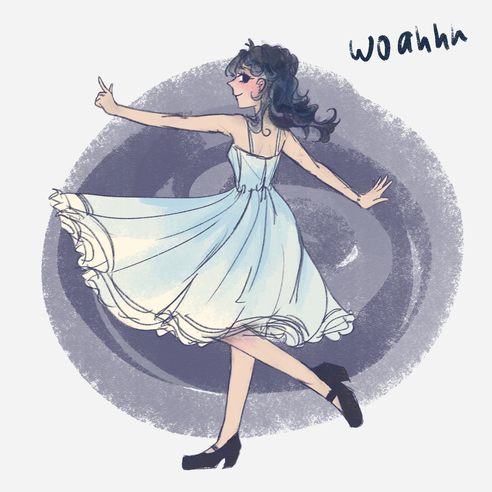
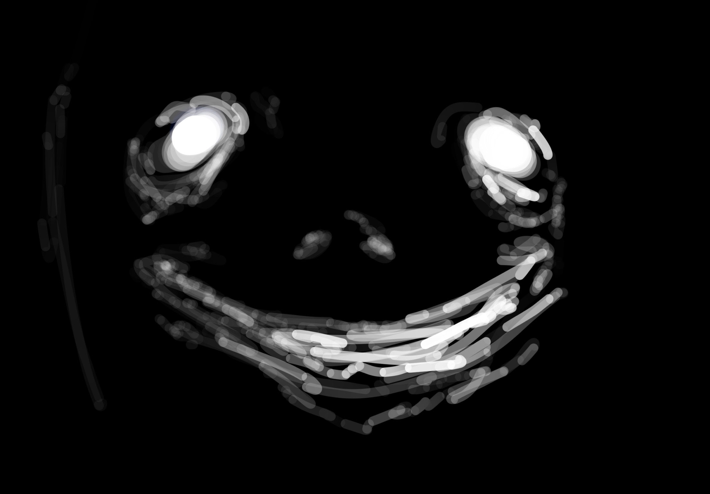

```{r setup, include=FALSE, echo=FALSE}
knitr::opts_chunk$set(echo = FALSE,
                      warning = FALSE, # suppressing warning messages
                      message = FALSE,
                      knitr.kable.max_rows = 6)

# attach any relevant packages
library("knitr")
library("ggplot2")
library("dplyr")
library("rmarkdown")

# read the data files
courses <- read.csv(file = "courses.csv")
hobbies <- read.csv(file = "hobbies.csv")
```

# This R Markdown is to get to know Laeticia!

## Bio {#bachelors-degree}
My name is Laeticia! I am a 4th year at UofT as of writing this. My programs are Bioinformatics and Computational Biology specialist, Molecular Genetics and Microbiology major, and Computer Science minor. I like nerdy stuff. Specifically, the weeb-y side of nerd. Concerning more serious topics, I've always been a life sciences person since I was a kid. Right now, the fields I find most interesting are dev. bio, evol. bio and mol. gen!

## Bachelors Degree 
### All the courses I've taken{#bachelors-degree-table}
**Table 1. Record of all undergraduate courses** 
``` {r courses_table, include=TRUE,echo=TRUE}
# generate table with knitr::kable()
colnames(courses) <- c("Course Dept", "Course Code", "Year", "Type")
paged_table(courses, options=list(rows.print=5))
```

### Courses by year and department {#bachelors-degree-figure}
The following figures show the distribution of the courses I've taken, according to year, and department.
``` {r courses_figure, include=TRUE, echo=TRUE, fig.cap = "**Figure 1: Courses by Year** Courses according to the year and department."}
## organize the data for plotting
# idk what to do here

# generate plot 
ggplot2::ggplot(data=courses,
                mapping=aes(x=`Course Dept`,
                            fill=as.factor(`Year`))) +
  ggplot2::geom_bar(position="stack",
                    show.legend=T) +
  ggplot2::labs(title="Courses by Dept",
                x="Dept",
                y="Number of courses",
                fill="Year")

```

## Hobbies
### What are my hobbies? {#my-hobbies}
I have a lot of dumb hobbies! They have changed over the years but generally all loser activities.
```{r r hobbies-hours-per-week, include=TRUE, echo=TRUE, fig.cap = "**Figure 2: Hobbies** My hobbies"}
paged_table(hobbies, options=list(rows.print=5))
```

### My Fav Hobby {#my-favourite-hobby}
Ermm... playing games? Listening to music? I also like baking!

## Custom section {#custom-section}

I drew this!


I also drew this!


## Questions to answer 

1.[ What is your bachelors degree?](#bachelors-degree)
Honours Bachelors of Science? My programs are BCB, MoGen and CS!

2.[Which courses have you taken and in which departments?](#bachelors-degree-figure)
A lot...

3.[What are your hobbies?](#my-hobbies)
A lot too...

4.[How many hours a week do you spend on each hobby?](#hobbies-hours-per-week)
A lot!

5.[What is your favorite hobby?](#favorite-hobby)
Listening to music maybe??

6.[Add a custom section of your choosing!](#custom-section)
I put some stuff I drew~~

## References
